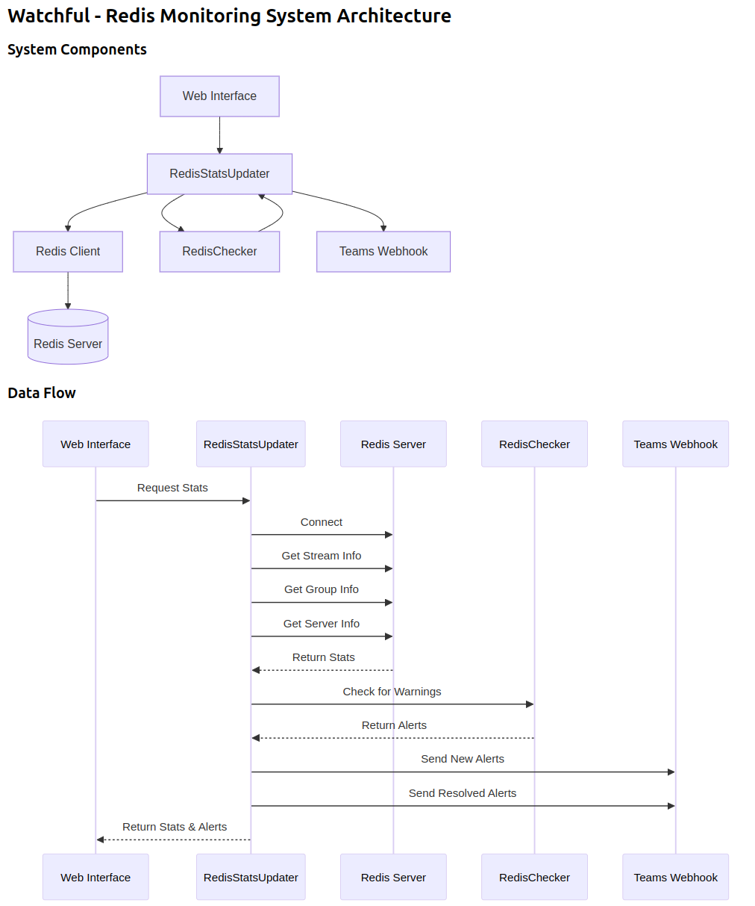

# Watchful
Tracks Redis memory usage and stream health and renders the stats in a webpage, automatically alerting support teams via MS Teams channel

## Installation
To get started with the Nursery System REST API, follow these steps:
1. Clone the repository to your local machine. `git clone <Repo Link>`
2. Install the required dependencies by running `deno install`.
3. Add your variables in the `.env` file  
    ```bash
    REDIS_URL = <your_database_uri>
    TEAMS_WEBHOOK_URL = <your_channel_url>
    CHECK_INTERVAL_MINS = 5
    APP_URL = http://localhost:3000
    ```
4. Start the server by running 
    ```bash 
    deno run start
    ```

## Architecture


